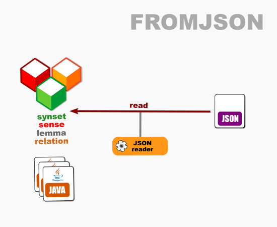

# OEWN model-from-JSON

This reads a model from JSON format.

Project [fromjson](https://github.com/oewntk/fromjson)

## Dataflow

## Maven Central

		<groupId>io.github.oewntk</groupId>
		<artifactId>fromjson</artifactId>
		<version>3.0.1</version>
